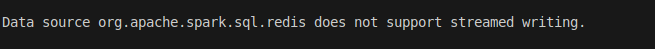
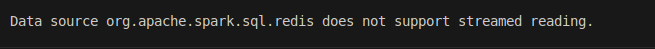

## `Run`
```bash
docker compose up
```

## `Config`
```python
from pyspark import SparkConf
from pyspark.sql import SparkSession
from pyspark.sql.functions import split

conf = SparkConf() \
    .setAppName("Elastic-App") \
    .set("spark.jars.packages","com.redislabs:spark-redis_2.12:3.1.0")

spark = SparkSession.builder.config(conf=conf)\
    .getOrCreate()
```

## `Write to redis`
```python
# Sample data
data = [("1", "John", 25),
        ("2", "Alice", 30),
        ("3", "Bob", 22)]
# Define the schema
schema = ["id", "name", "age"]
# Create a DataFrame
df = spark.createDataFrame(data, schema=schema)
# Write DataFrame to Redis
df.write \
    .format("org.apache.spark.sql.redis") \
    .option("table", "people") \
    .option("key.column", "id") \
    .option("host", 'localhost') \
    .option("port", 6380) \
    .mode("overwrite") \
    .save()
```

## `Read from redis` 
```python
df = spark.read.format("org.apache.spark.sql.redis").option("host", 'localhost').option("port", 6380) .option("table", "people").option("key.column", "id") .load()
df.show()

```

## `Write Stream to redis` + see documantation [here]('https://github.com/RedisLabs/spark-redis/tree/master/doc')
- Java
  ```java
  val query = sensors
  .writeStream
  .outputMode("update")
  .foreachBatch { (batchDF: DataFrame, batchId: Long) =>
    batchDF
      .write
      .format("org.apache.spark.sql.redis")
      .option("table", "output")
      .mode(SaveMode.Append)
      .save()
  }
  .start()

    query.awaitTermination()
  ```
- python
  
    

## `Read Stream from redis` + see documantation [here]('https://github.com/RedisLabs/spark-redis/tree/master/doc')
- Java
  ```java
  val sensors = spark
      .readStream
      .format("redis")                        
      .option("stream.keys", "sensors")       
      .schema(StructType(Array(                 
        StructField("sensor-id", StringType),
        StructField("temperature", FloatType)
      )))
      .load()

    val query = sensors
    .writeStream
    .format("console")
    .start()

    query.awaitTermination()
  
  ```
- python
  
    


    

